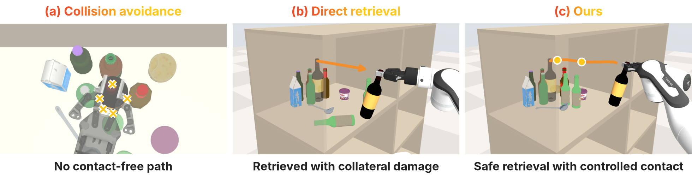
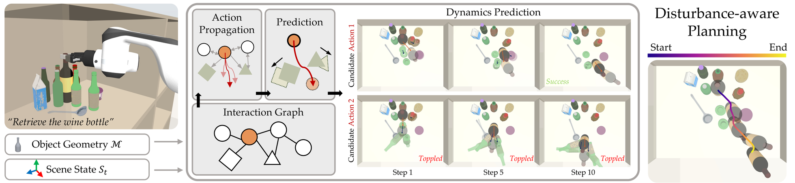
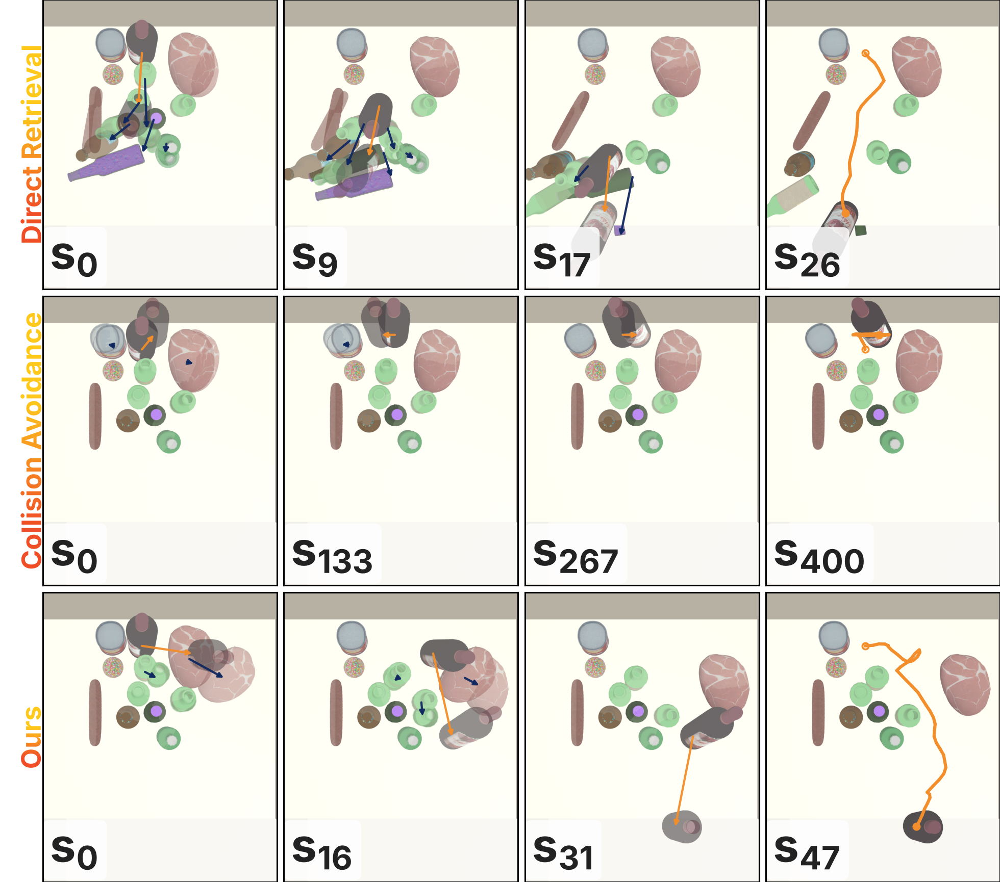
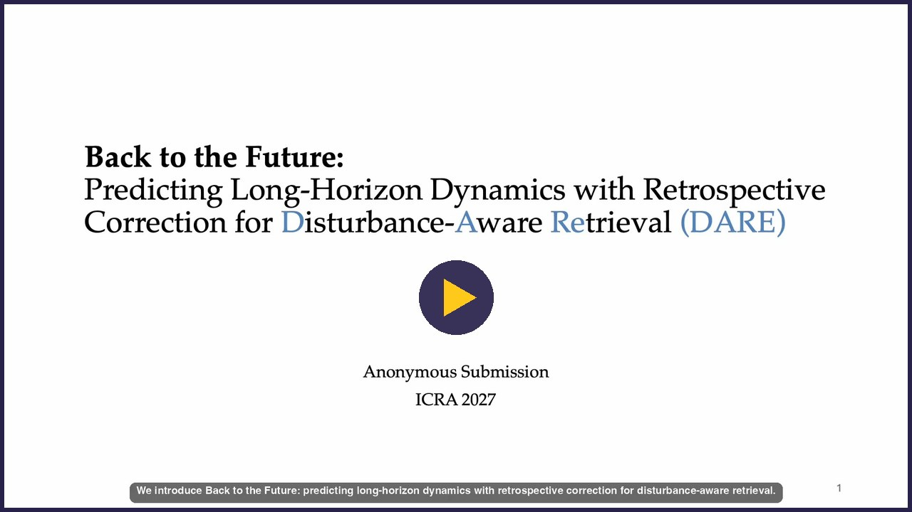

<h1 align="center">Back to the Future</h1>

<p align="center"><b>Predicting Long-Horizon Dynamics with Retrospective Correction for Disturbance-Aware Retrieval</b></p>

<p align="center">Anonymous authors · ICRA 2027 submission (under review)</p>

<p align="center">
  <a href="https://the-back-to-the-future.github.io/"></a>
  <a href="https://the-back-to-the-future.github.io/#video"></a>
  
  
</p>

<p align="center"></p>

**Fig. 1: Disturbance-aware retrieval.** (a) Collision avoidance leaves the target blocked. (b) Direct retrieval topples a neighboring object. (c) Our method predicts contact-induced disturbance to plan retrieval through controlled contact, preserving stability of surrounding objects.

## Abstract

Retrieving objects from densely packed storage requires **anticipating how contact disturbs surrounding objects** when limited clearance prevents lifting the target over clutter. However, contact can *propagate beyond the target’s immediate neighbors*, while accumulated prediction errors make learned dynamics *unreliable over long planning horizons*. We introduce **DARE (Disturbance-Aware REtrieval)**, a geometry-aware relational dynamics framework that uses **retrospective correction** to improve long-horizon prediction for disturbance-aware retrieval. DARE encodes compact object descriptors and predicts action-conditioned disturbance propagation through **object-level message passing**. When a sparse observation becomes available, a learned corrector uses the prediction discrepancy to **amend an earlier predicted state** and reruns the intervening dynamics, propagating the correction through the predicted contact chain. These predictions guide a receding-horizon planner that balances retrieval progress against displacement and rotation of surrounding objects, **permitting necessary contact while discouraging harmful disturbance**. Experiments in planar and RoboCasa environments evaluate long-horizon prediction, generalization, and robustness for disturbance-aware retrieval in dense clutter.

## Method

<p align="center"></p>

**Fig. 2: Pipeline Overview.** Given object geometry and the current scene state, DARE propagates action-conditioned interactions over an object graph to predict scene evolution under candidate target motions. The resulting rollouts capture direct and indirect disturbances to surrounding objects, enabling the planner to select a retrieval trajectory that balances goal progress against collateral disturbance.

The [project page](https://the-back-to-the-future.github.io/#method) walks through each part of the method:

- **Problem Statement**
- **Relational Dynamics Prediction**
- **Retrospective Correction from Sparse Observations**
- **Future-aware Joint Predictor–Corrector Learning**
- **Disturbance-Aware Retrieval Planning**

## Results

| | Success rate |
|---|---|
| DARE, 20 objects, hard placement, clean observations | **1.00** |
| Direct retrieval, same scenes | 0.10 |
| DARE under noisy observations, 10 objects, easy placement: without → with retrospective correction | 0.00 → **1.00** |

Numbers from Table I of the paper; the full table, the dynamics-prediction and correction figures (interactive), and the videos are on the [project page](https://the-back-to-the-future.github.io/).

<p align="center"></p>

**Fig. 5: Object Retrieval Visualization.** Top-down views compare three planners, with target motion marked in orange. Each row shows four evenly spaced execution steps with translucent next-step poses and the executed target path in the final frame.

## Supplementary video

<p align="center"><a href="https://the-back-to-the-future.github.io/#video"></a></p>

## Citation

```bibtex
@article{anonymous2026backtothefuture,
  title  = {Back to the Future: Predicting Long-Horizon Dynamics with Retrospective Correction for Disturbance-Aware Retrieval},
  author = {Anonymous},
  year   = {2026}
}
```

<details>
<summary><b>Site structure</b> (for maintainers)</summary>

- `index.html`: the page content only, one `<section>` per paper section; behaviour is attached through `data-` attributes.
- `assets/css/site.css`: every style; colours are tokens on `:root`, breakpoints at 1068 px and 734 px.
- `assets/js/site.js`: page behaviour, one init function per feature (continuous corners, hero video chapters, highlight strip, method steps and their pinned pipeline crop, carousels, BibTeX copy), loaded with `defer`.
- Rounded corners: every element the stylesheet rounds is redrawn by `site.js` with Apple's continuous corner curve (clip path plus a stroked edge coloured by the component's `--edge` token); the CSS `border-radius` is the fallback without JavaScript.
- `assets/js/charts.js`: the interactive figures; each `figure[data-chart]` (`bars` or `lines` plotting `data-chart-y` `ratio` or `value`; `steps` or `noise` for the E2 figures) loads the JSON its `data-chart-src` names and builds its controls, plot, tooltip, legend and table view; the figure's markup is only its caption.
- `assets/js/table.js`: Table I from `assets/data/table-1.json` and the headline numbers (`[data-stat]`) read from the same file.
- `assets/js/corrector.js`: the interactive correction figure from `assets/data/corrector.json`; the static figure in the markup is its fallback.
- Carousels: `site.js` shows one `[data-carousel-slide]` of a `[data-carousel]` at a time, stepped by its arrow buttons or the arrow keys.
- `assets/js/vendor/`: Chart.js 4.5.1 (MIT, licence beside it), vendored so the page makes no third-party requests.
- `assets/data/`: chart and table data, exported from the paper figures' own data files (never edited by hand).
- `assets/media/`: videos, posters and figures, named by content and size (for example `hero-947-3840.mp4`); `social-preview.png` is the link-preview card.

Served by GitHub Pages from the root of `main`; no build step.

</details>
